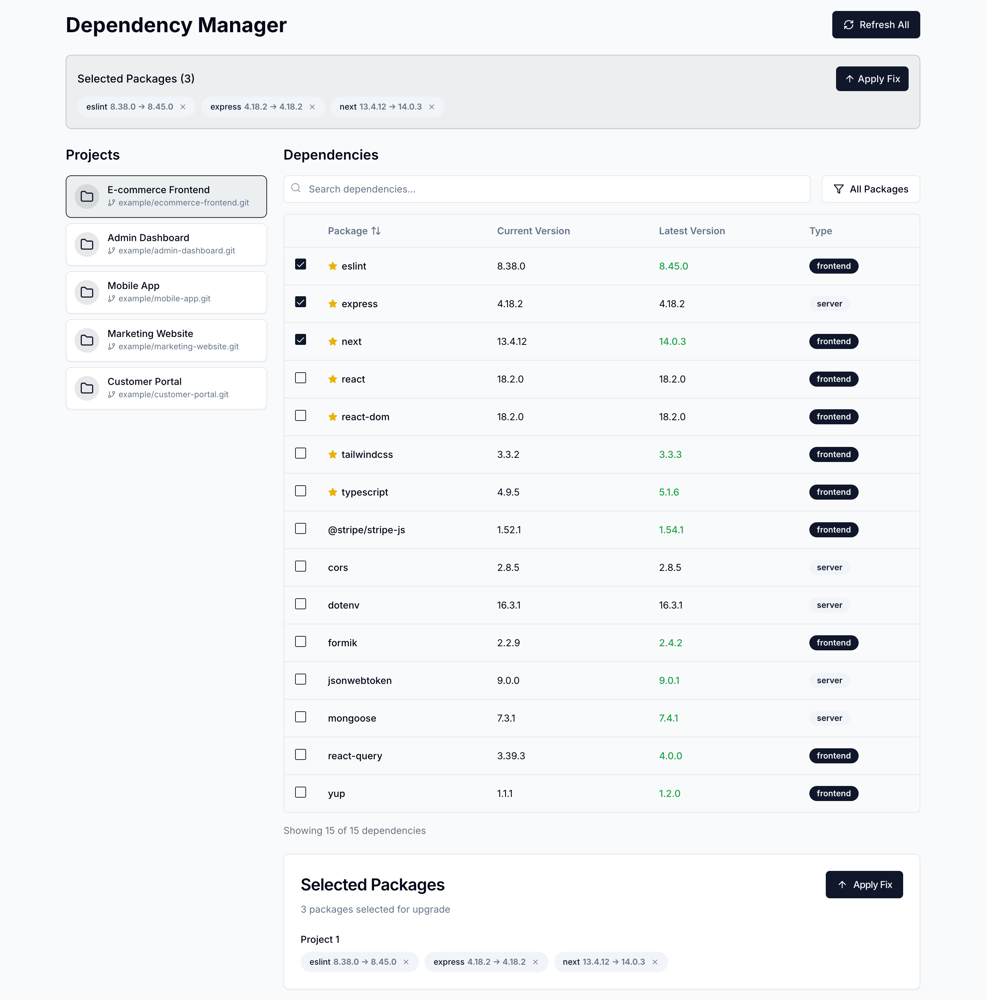

# Check‑Update: Package & Docker Version Manager

 


 
A unified tool to track, compare, and upgrade both npm package dependencies and Docker image versions across multiple projects.

 
## Features

 
- View current vs. latest versions for npm packages and Docker images
- Bulk-select updates with warnings for major version changes
- Support for local and remote projects (auto‑clone from Git)
- Clear UI with project list and dependency tabs
- Semantic version comparison and safe upgrade flow

 
## Prerequisites

 
- Node.js v14+ and npm or yarn
- Git (for remote repository support)

 
## Installation

 
1. Clone this repository:

 
```bash
git clone <repo-url>
cd check-update
```

 
2. Install dependencies:

 
```bash
cd backend && yarn install
cd ../frontend && yarn install
```

 
## Configuration

 
Edit `projects.json` in the root directory to list your projects and optionally set which package manager to use via env var:

 
```json
[
  {
    "name": "project1",
    "path": "./project1",
    "frontend": { "path": "./project1/frontend/package.json", "dockerfile": "./project1/frontend/Dockerfile" },
    "server": { "path": "./project1/server/package.json", "dockerfile": "./project1/server/Dockerfile" }
  },
  {
    "name": "project3",
    "remote": "https://github.com/owner/repo.git",
    "path": "./project3",
    "frontend": { "path": "./project3/frontend/package.json" }
  }
]
```

### Package Manager Quick-Update Flag

By default, the tool uses npm. To switch to Yarn, set:
```bash
export PACKAGE_MANAGER=yarn
```
All installs will use lockfile-only flags:
- npm: `npm install --package-lock-only`
- Yarn: `yarn install --mode update-lockfile`

 
## Running the App

 
1. Start backend on port 3001:

 
```bash
cd backend
yarn start
```

 
2. Start frontend on port 3000:

 
```bash
cd ../frontend
yarn start
```

 
3. Open [http://localhost:3000](http://localhost:3000) in your browser

 
## Usage

 
- Select a project from the sidebar
- Switch between **NPM Packages** and **Docker Images** tabs
- Search, filter, and checkbox-select items needing updates
- Click **Apply Fix** to batch-upgrade safe updates
- Major upgrades are flagged; proceed with caution

 
## API Endpoints

 
- `GET /api/projects` — list configured projects
- `GET /api/packages` — get npm dependencies across projects
- `POST /api/upgrade` — upgrade selected npm packages
- `GET /api/docker/images` — list Docker images
- `POST /api/docker/upgrade/:project` — upgrade Docker images for a project

 
## Project Structure

 
```
check-update/
├── backend/         # Express server (port 3001)
│   ├── src/
│   │   ├── controllers
│   │   ├── services
│   │   ├── routes
│   │   └── index.js
│   └── package.json
├── frontend/        # React app (port 3000)
│   ├── src/
│   │   ├── components
│   │   ├── context
│   │   ├── hooks
│   │   └── App.js
│   └── package.json
└── projects.json    # Your project configs
```

 
## License

 
Apache 2.0